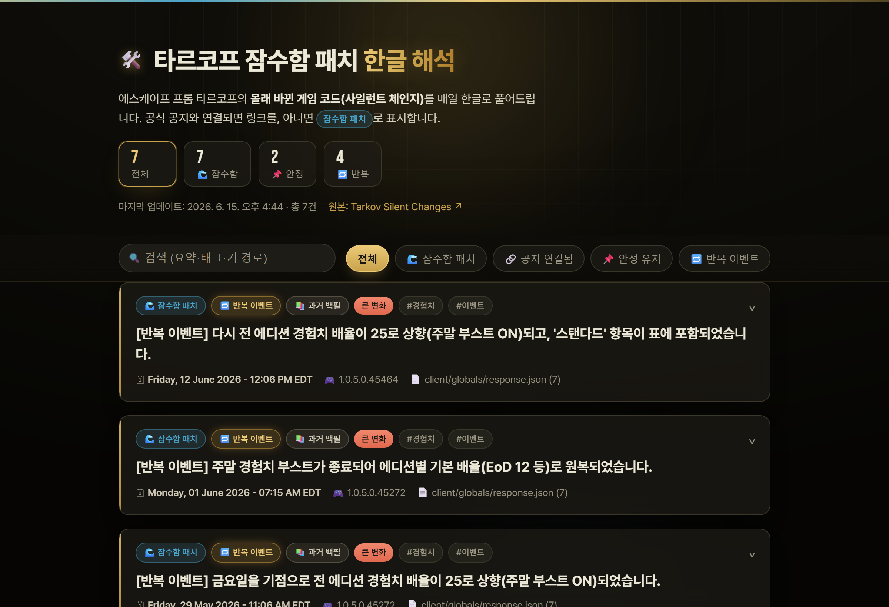
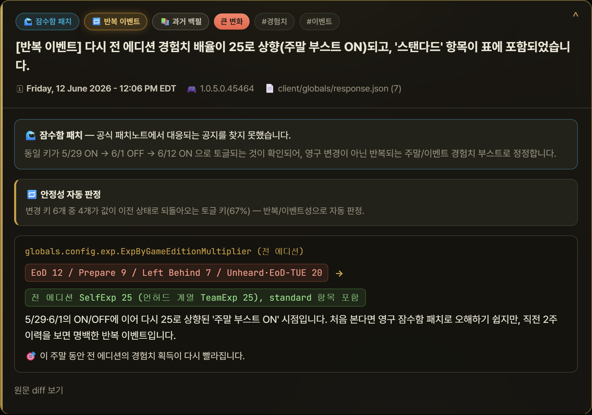

<div align="center">

# 🛠️ Tarkov Silent Changes — Korean Interpretation

🇰🇷 [한국어](README.md) · 🇬🇧 English

**A static web app that automatically translates and interprets Escape From Tarkov's *silently changed game code (silent changes)* into Korean every day**

[](https://moriochoradio.github.io/tarkov-korean-changes/)

[](https://moriochoradio.github.io/tarkov-korean-changes/)
[](https://www.python.org/)
[-6f42c1?logo=github)](https://docs.github.com/en/github-models)
[](LICENSE)
[](https://changes.tarkov-changes.com/)

<br/>



</div>

---

The source data comes from [Tarkov Silent Changes](https://changes.tarkov-changes.com/);
when a change can be linked to official patch notes, a link is shown — otherwise it is labeled a **"silent change"**.
Going further, the full change history is cross-referenced to automatically determine whether each change **has held stable / was later superseded / is a recurring event**.

> ⚠️ This is an unofficial fan project. The interpretations are LLM-generated and may contain errors.

## ✨ Key Features

| | Feature | Description |
|---|---|---|
| 🔎 | **Silent change tracking** | Collects the latest changes from `changes.tarkov-changes.com` every day |
| 🇰🇷 | **Automatic Korean interpretation** | An LLM unpacks the diff and explains "what it means in-game" (including before/after and impact) |
| 🌊 | **Silent-patch detection** | Matches changes against official patch notes; if no corresponding announcement exists, they're flagged as silent changes |
| 📊 | **Automatic stability classification** | Cross-references history to auto-classify as `📌 stable` / `♻️ superseded` / `🔁 recurring event` |
| 🔁 | **Recurring event detection** | Automatically recognizes on/off toggles like weekend XP boosts and airdrop events |
| 📚 | **Historical backfill** | Collects and interprets past changes via `/list` and `/view/{id}` to enrich the timeline |
| 🎨 | **Responsive dark UI** | A static, buildless site with glass cards, stat filters, search, and smooth animations |

<div align="center">

<br/><sub>Change card — silent-patch detection · automatic stability classification · before/after · raw diff</sub>
</div>

## ⚙️ How It Works

```
Daily (GitHub Actions cron)
  └─ pipeline.py
       1) scrape      collect the latest change from changes.tarkov-changes.com/latest
       2) patchnotes  gather candidate official patch notes (manual + automatic)
       3) interpret   Korean interpretation via LLM + patch-note matching → silent-patch detection
       4) stability   cross-reference full history for automatic stability classification
       5) store       append only new entries to data/entries.json
       6) build       generate docs/data.json (the feed the site reads)
  └─ commit the changes → GitHub Pages statically hosts docs/
```

The static site (`docs/`) renders by reading a single `data.json` file, with no separate build step.

## 📊 Automatic Stability Classification

Each change's raw diff is parsed into `(file, key path, old value, new value)` units, and by looking at
how the same key changes later across the full history, changes are classified automatically (`scripts/stability.py`).

- 📌 **stable** — the same key has never changed again after this change (presumed still in effect).
- ♻️ **superseded** — the same key changed again later (not a revert). The value has since been updated further.
- 🔁 **recurring** — the majority of the key's changes are toggles reverting to a previous state.
  Automatically catches **changes that flip on and off repeatedly**, like weekend XP boosts and airdrop events.

> 💡 In practice, this feature revealed through data that an **XP multiplier change to 25** that looked like a
> "permanent silent patch" was actually a **weekend boost** recurring *ON on Friday · OFF on Monday*.

Classification runs automatically in the daily pipeline; when the logic or history changes, recompute everything with:

```bash
python scripts/recompute_stability.py
```

## 🧭 Why I Built It This Way — Technical Choices Q&A

**Q. Why Python?**
A. The core of this project is HTML scraping (`requests` + `BeautifulSoup`), regex-based diff parsing (`scripts/stability.py`), and JSON processing — all things Python solves with the least code. There are effectively only 2 external dependencies (requests, beautifulsoup4), so a single `pip install` on a GitHub Actions runner makes it reproducible every day.

**Q. Where does the data (game code diffs) come from, and why that approach?**
A. There is no official API, so I parse the `/latest` (single most recent change) and `/view/{id}` (past history) pages that [tarkov-changes.com](https://changes.tarkov-changes.com/) exposes without login. To avoid burdening the source site, requests are made **only once a day** (the backfill also inserts delays between requests and declares an identifiable User-Agent), transient failures like 502s are handled with exponential backoff, and given the nature of `/latest`, a run only fails **after two consecutive days of failure** — so alerts fire only when the risk of data loss is real.

**Q. Why a static (buildless) web app?**
A. The data changes only once a day, so a server, database, and framework are all overkill. The pipeline generates just one file, `docs/data.json`; vanilla JS reads and renders it, and GitHub Pages hosts it for free — operating cost and maintenance surface both converge to zero.

**Q. Why was "automatic stability classification" needed, and how was it implemented?**
A. Silent changes come with no announcement, so the real problem was that you couldn't tell "is this change still in effect?" So I parse diffs into `(file, key path, old value, new value)` units, build a per-key timeline index over the full history, and auto-classify as `stable / superseded / recurring` based on whether the same key changes again later, or whether toggles reverting to a previous value form the majority (`scripts/stability.py`). This logic proved with data that an "XP multiplier change that looked like a permanent patch" was actually an event switching on and off every weekend.

**Q. Why GitHub Actions?**
A. A once-a-day cron batch needs no always-on server, and Actions covers collect → LLM interpretation → commit results → Pages deploy on one platform, for free. The automatically provided `GITHUB_TOKEN` alone handles both commit permission and GitHub Models calls (`permissions: contents: write, models: read`), so there's no separate secret management either. Setting the cron to 14:23 UTC rather than on the hour was also the result of measuring, then avoiding, the 1–2 hour delays of GitHub's congested cron slots.

**Q. Why GitHub Models as the default LLM?**
A. With one call a day, the free tier is plenty, and since it uses Actions' `GITHUB_TOKEN` as-is, worries about API key registration, cost, and leakage all disappear. That said, `scripts/interpret.py` is built with a provider abstraction so a single environment variable switches to Anthropic/OpenAI, and without a key it runs in stub mode so the pipeline never breaks. Even if an LLM call fails, that day's entries are held as "pending interpretation" and automatically retried on the next run.

## 📚 Historical Backfill (Optional)

You can collect past silent changes exposed via `/list` and `/view/{id}` and fill in Korean interpretations.

```bash
# 1) Harvest past raw data (politely, with delays between requests)
python scripts/backfill_harvest.py --start <latest-id> --count 120 --delay 0.7
# 2) Write Korean interpretations in data/backfill_interp.json, then merge and apply
python scripts/backfill_apply.py
```

## 🗂️ Folder Structure

```
.
├── pipeline.py                # daily pipeline orchestrator (+ automatic stability classification)
├── scripts/
│   ├── scrape.py              # site parsing
│   ├── patchnotes.py          # official patch note collection
│   ├── interpret.py           # LLM interpretation + matching
│   ├── stability.py           # diff parsing + stability classification (toggle/re-change detection)
│   ├── backfill_harvest.py    # harvest past /view/{id} history (raw)
│   ├── backfill_apply.py      # merge and apply past interpretations (backfill_interp.json)
│   └── recompute_stability.py # recompute stability for all existing entries
├── data/
│   ├── entries.json           # accumulated interpretation data (source store)
│   ├── history_raw.json       # raw past history (basis for recurrence detection)
│   ├── backfill_interp.json   # Korean interpretations of past entries (hand-curated)
│   └── patchnotes_manual.json # manually added official patch notes (optional)
├── docs/                      # ← GitHub Pages root
│   ├── index.html / style.css / app.js
│   ├── assets/                # README/OG images
│   └── data.json              # build output (site feed)
├── tests/
├── .github/workflows/daily.yml
└── requirements.txt
```

## 🚀 Deployment (GitHub)

1. **Push this folder to a GitHub repository.**

2. **Enable GitHub Pages** — `Settings → Pages → Build and deployment`
   - Source: **Deploy from a branch**
   - Branch: **main** / folder **`/docs`** → Save
   - After a moment, check `https://<username>.github.io/<repo-name>/`.

3. **LLM setup — GitHub Models by default (free, no key required)** 🎉
   It works out of the box with no extra configuration. The workflow calls
   [GitHub Models](https://docs.github.com/en/github-models) with the `GITHUB_TOKEN`
   automatically provided by GitHub Actions, so **there is no API key registration and no cost.**
   (One call a day, so the free tier is plenty.)

   - To change just the model, go to `Settings → Secrets and variables → Actions → Variables`:
     - `LLM_MODEL` = e.g. `openai/gpt-4o`, `openai/gpt-4o-mini`, `meta/Llama-3.3-70B-Instruct`
     - `PATCHNOTES_URL` = URL of the official patch notes page (default: EFT official news)
   - Only if you want to **switch to a paid provider** (optional):
     - **Variables** → `LLM_PROVIDER` = `anthropic` or `openai`
     - **Secrets** → register `ANTHROPIC_API_KEY` or `OPENAI_API_KEY`

4. **Check workflow permissions** — `Settings → Actions → General → Workflow permissions` →
   enable **Read and write permissions** (required for the bot to commit results).

5. **First run** — `Actions` tab → "매일 타르코프 변경 해석" (Daily Tarkov change interpretation) → run manually via **Run workflow**.
   It then runs automatically every day (adjust via the cron in `daily.yml`).

## 💻 Run/Test Locally

```bash
pip install -r requirements.txt

# 1) Automatic interpretation with GitHub Models (free) — all you need is a GitHub token
export GITHUB_TOKEN=ghp_...               # a token with models:read permission
python pipeline.py

# 1-b) Interpret with a paid provider
LLM_PROVIDER=anthropic ANTHROPIC_API_KEY=sk-ant-... python pipeline.py

# 2) Check the structure without a key (stub mode — shows raw diffs only)
LLM_PROVIDER=stub python pipeline.py

# 3) Preview the site
cd docs && python -m http.server 8000
#  → http://localhost:8000
```

## 🔧 Customization Points

- **Interpretation quality/tone**: edit `SYSTEM_PROMPT` and `USER_TEMPLATE` in `scripts/interpret.py`.
- **Patch-note matching accuracy**: add official announcements directly to `data/patchnotes_manual.json`
  and they will be used first as LLM matching candidates (a safety net when automatic collection is blocked).
- **Stability sensitivity**: `RECURRING_RATIO` in `scripts/stability.py` (default 0.5).
- **Number of items shown**: `FEED_LIMIT` in `pipeline.py`.
- **Run time**: the cron in `.github/workflows/daily.yml`.
- **Theme/design**: `docs/style.css` (color variables at the top of `:root`).

## ⚠️ Limitations and Caveats

- The no-login `/latest` page shows only the single most recent change, but past history is also accessible
  via `/list` and `/view/{id}` (the backfill uses this). The everyday pipeline accumulates the latest change daily.
- If the site's structure changes, the parsing in `scripts/scrape.py` may need adjusting.
- The default provider (GitHub Models) is free. API costs arise only if you switch to a paid provider.
- Respect the source site's and BSG's terms of service and robots policies. To avoid excessive requests, calls are made only once a day.

## 📜 License / Disclaimer

- The code is distributed under the [MIT License](LICENSE).
- The rights to *Escape from Tarkov* and related assets belong to **Battlestate Games**.
  This project is an unofficial fan work unrelated to BSG, and the data source is
  [tarkov-changes.com](https://changes.tarkov-changes.com/).

<div align="center"><sub>Made with 🛠️ for the Tarkov community</sub></div>
